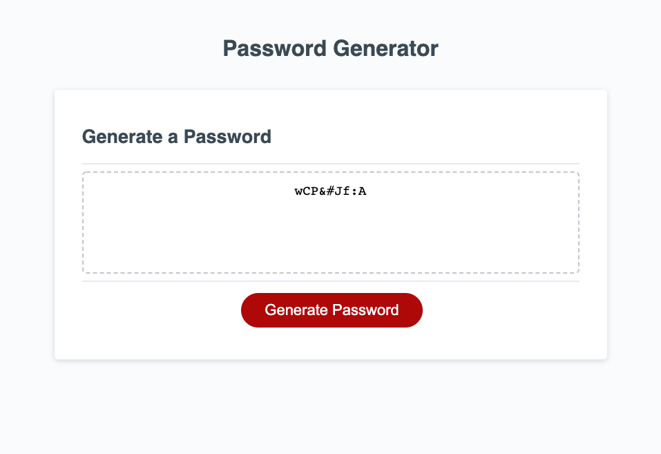

# Konnen Hannaford.  Password-Generator

Site can be accessed here: https://konnenhannaford.github.io/password-generator/  
The source can be retrieved by cloning and pulling from https://github.com/konnenhannaford/password-generator  

# About
This page is a password generator that allows for the generation of passwords using a set of restrictive criteria.  

# Tools used
HTML, CSS, Javascript

# Updates
* Site has been updated to make generate button feature applicable
* Site has been updated to allow the creation of a password meeting our criteria
* Site has been updated to show an error message when at least one of these criteria are not met
* Site will now generate the working password in the box on site
* Coding for site has been streamlined for efficiency
* A repo following best practice has been created
* A ReadMe detailing the site and its workings has been created
* Site has been deployed as a live site and applications loads with no errors

# Completed Tasks
Task  
Created a prompt that asks for amount of characters included in the password.  Criteria is between 8 and 128 characters  
Created a series of prompts that need responding to in order to create a password including  
* Uppercase
* Lowercase
* Special
* Numbers  
Created a password to generate when criteria is met

Repository:
* Repository has a unique name that follows practice for structure and naming.
* Repository follows best practices for formatting and source code
* Repository contains multiple descriptive commit messages.
* Repository contains quality readme file with description, screenshot, and link to deployed application.

# When the page is loaded:
Site shows a page with a password generator included

# Making Changes
Repo is public and can be updated by all via https://github.com/konnenhannaford/password-generator 

# Learnings and changes
Completing this has increased familiarity with the process of Javascript and its applications to a website.  It is very complex area that will require further investigation as it is essential to a large are of roles and tasks.  

# Licence
Copyright <2021> <Password-generator>

Permission is hereby granted, free of charge, to any person obtaining a copy of this software and associated documentation files (the "Software"), to deal in the Software without restriction, including without limitation the rights to use, copy, modify, merge, publish, distribute, sublicense, and/or sell copies of the Software, and to permit persons to whom the Software is furnished to do so, subject to the following conditions:

The above copyright notice and this permission notice shall be included in all copies or substantial portions of the Software.

THE SOFTWARE IS PROVIDED "AS IS", WITHOUT WARRANTY OF ANY KIND, EXPRESS OR IMPLIED, INCLUDING BUT NOT LIMITED TO THE WARRANTIES OF MERCHANTABILITY, FITNESS FOR A PARTICULAR PURPOSE AND NONINFRINGEMENT. IN NO EVENT SHALL THE AUTHORS OR COPYRIGHT HOLDERS BE LIABLE FOR ANY CLAIM, DAMAGES OR OTHER LIABILITY, WHETHER IN AN ACTION OF CONTRACT, TORT OR OTHERWISE, ARISING FROM, OUT OF OR IN CONNECTION WITH THE SOFTWARE OR THE USE OR OTHER DEALINGS IN THE SOFTWARE.
  
# Site Screenshot

